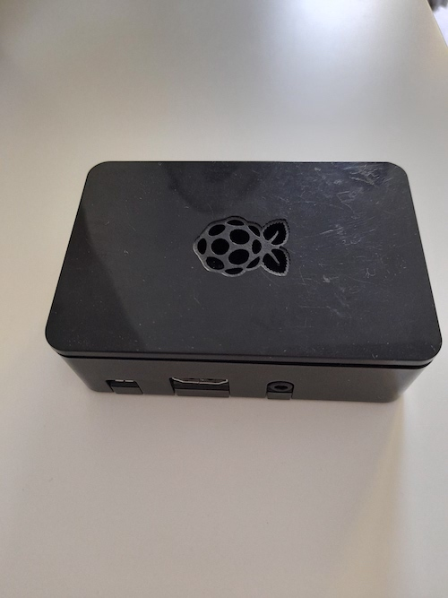
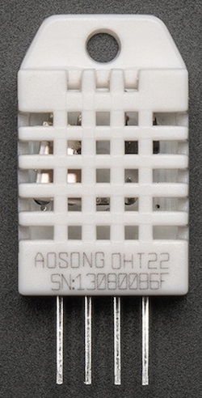
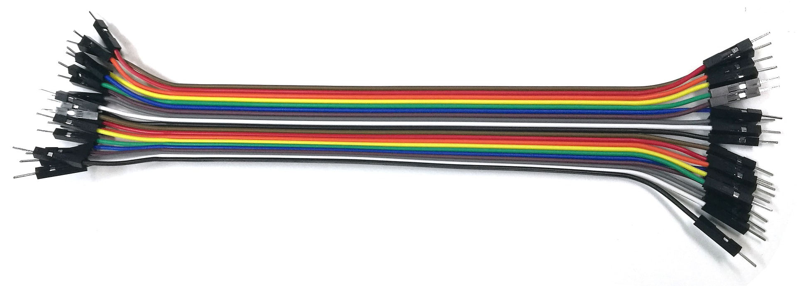

# Remote-Sensing-Algorithms
A collection of useful algorithms for remote sensing applications primarily focused on utilising single board computers and additional sensors.

## Scripts
'Read_DHT22_Data.py' is a script for reading temperature and humidity data from the DHT22 sensor connected to the Raspberry Pi. It has a widee range of applications such as monitoring the interior conditions of a commercial or residential building to remote sensing the conditions inside of a greenhouse and other agricultural settings. 

## Hardware
### Raspberry Pi Model 3B+

### DHT22 Temperature & Humidity Sensor

### Female-Female Jumper Wires

## License
MIT License

Copyright (c) 2020 Samuel Russell

Permission is hereby granted, free of charge, to any person obtaining a copy
of this software and associated documentation files (the "Software"), to deal
in the Software without restriction, including without limitation the rights
to use, copy, modify, merge, publish, distribute, sublicense, and/or sell
copies of the Software, and to permit persons to whom the Software is
furnished to do so, subject to the following conditions:

The above copyright notice and this permission notice shall be included in all
copies or substantial portions of the Software.

THE SOFTWARE IS PROVIDED "AS IS", WITHOUT WARRANTY OF ANY KIND, EXPRESS OR
IMPLIED, INCLUDING BUT NOT LIMITED TO THE WARRANTIES OF MERCHANTABILITY,
FITNESS FOR A PARTICULAR PURPOSE AND NONINFRINGEMENT. IN NO EVENT SHALL THE
AUTHORS OR COPYRIGHT HOLDERS BE LIABLE FOR ANY CLAIM, DAMAGES OR OTHER
LIABILITY, WHETHER IN AN ACTION OF CONTRACT, TORT OR OTHERWISE, ARISING FROM,
OUT OF OR IN CONNECTION WITH THE SOFTWARE OR THE USE OR OTHER DEALINGS IN THE
SOFTWARE.
